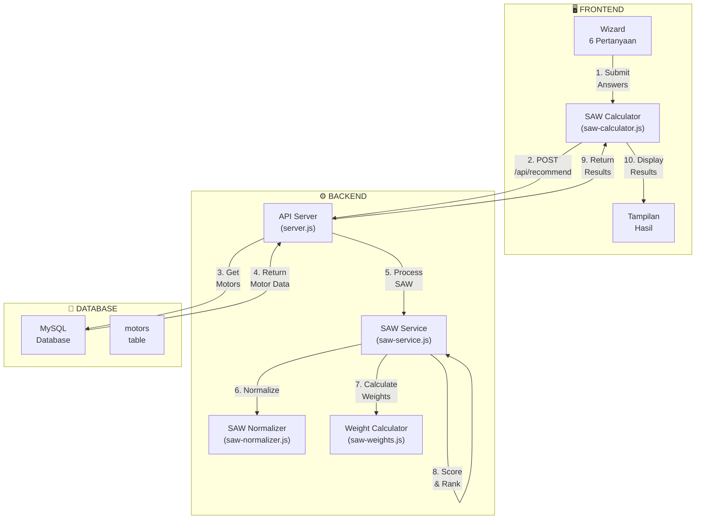
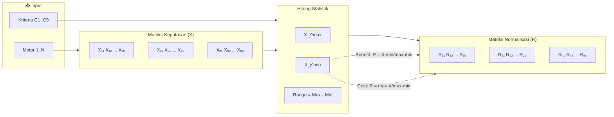
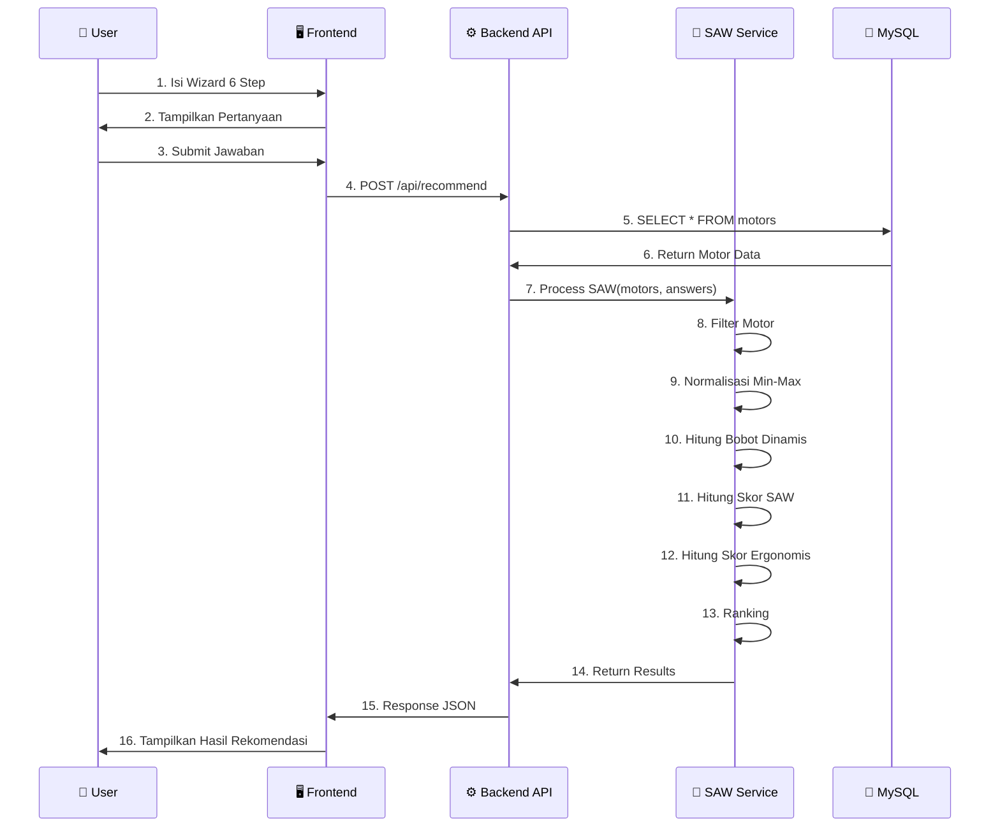
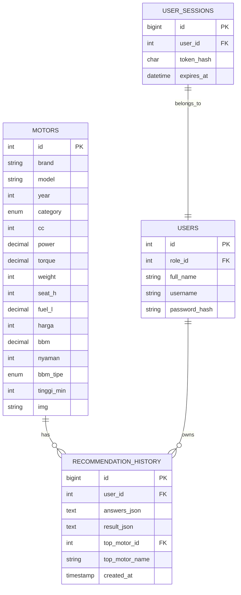

# Alur Sistem - MotorMatch SAW

**Versi:** 1.0.0
**Author:** MotorMatch TOSAN
**Tanggal:** 2026-07-12

---

## 1. Diagram Arsitektur Sistem



---

## 2. Flowchart Proses Rekomendasi

```mermaid
flowchart TD
    Start([👤 User Membuka<br/>Halaman Rekomendasi]) --> Step1{User Memilih<br/>Budget}

    Step1 -->|Ya| Step2{User Memilih<br/>Usage}
    Step1 -->|Tidak| AskBudget{Apakah Budget<br/>Tidak Terbatas?}
    AskBudget -->|Ya| Step2
    AskBudget -->|Tidak| Reject1["❌ Kembali ke<br/>Step Budget"]

    Step2 --> Step3{User Memilih<br/>Tipe Motor}

    Step3 -->|Matic/Sport/Naked| Step4{User Memilih<br/>Prioritas}
    Step3 -->|Semua Tipe| Step4

    Step4 --> Step5{User Memilih<br/>Kapasitas CC}

    Step5 -->|CC ≤ 125| Step6A{User Memilih<br/>Tinggi Badan}
    Step5 -->|126-250cc| Step6B{User Memilih<br/>Tinggi Badan}
    Step5 -->|251-500cc| Step6C{User Memilih<br/>Tinggi Badan}
    Step5 -->|>500cc| Step6D{User Memilih<br/>Tinggi Badan}

    Step6A -->|Submit| Process["🔄 Processing..."]
    Step6B -->|Submit| Process
    Step6C -->|Submit| Process
    Step6D -->|Submit| Process

    Process --> FetchDB[📥 Fetch Data<br/>Motor dari DB]
    FetchDB --> CheckDB{"Database<br/>Available?"}

    CheckDB -->|Ya| Motors[📋 Ambil Semua<br/>Motor Data]
    CheckDB -->|Tidak| Fallback[📁 Gunakan Data<br/>Lokal]

    Motors --> Filter1["🔍 Filter Motor<br/>dengan Kriteria"]
    Fallback --> Filter1

    Filter1 --> CheckResults{"Motor yang<br/>Cocok ≥ 1?"}

    CheckResults -->|Ya| CalcNorm["📊 Normalisasi<br/>Min-Max"]
    CheckResults -->|Tidak| Relax1["🔓 Longgarkan<br/>Budget +25%"]

    Relax1 --> CheckResults2{"Motor yang<br/>Cocok ≥ 1?"}
    CheckResults2 -->|Tidak| Relax2["🔓 Budget +50%"]
    CheckResults2 -->|Ya| CalcNorm

    Relax2 --> CheckResults3
    CheckResults3 -->|Tidak| Relax3["🔓 Budget +100%"]
    CheckResults3 -->|Ya| CalcNorm

    Relax3 --> CheckResults4
    CheckResults4 -->|Tidak| Relax4["🔓 Hapus CC<br/>Filter"]
    CheckResults4 -->|Ya| CalcNorm

    Relax4 --> CheckResults5
    CheckResults5 -->|Tidak| Relax5["🔓 Toleransi<br/>Tinggi +15cm"]
    CheckResults5 -->|Ya| CalcNorm

    Relax5 --> CheckResults6
    CheckResults6 -->|Tidak| UseAll["📋 Tampilkan<br/>Semua Motor"]
    CheckResults6 -->|Ya| CalcNorm

    UseAll --> CalcNorm

    CalcNorm --> CalcWeight["⚖️ Hitung Bobot<br/>Dinamis"]
    CalcWeight --> CalcScore["📈 Hitung Skor<br/>SAW"]
    CalcScore --> CalcErgonomic["🧮 Hitung Skor<br/>Ergonomis"]
    CalcErgonomic --> Combine["🎯 Gabung Skor<br/>SAW 80% + Ergo 20%"]
    Combine --> Rank["🏆 Ranking Motor"]
    Rank --> Output[📤 Return Hasil<br/>ke Frontend]
    Output --> Display["🖥️ Tampilkan<br/>Rekomendasi"]

    Display --> End([✅ Selesai])
```



---

## 3. Diagram Alur SAW Normalization



---

## 4. Diagram Alur Bobot Dinamis

```mermaid
flowchart TD
    Start["⚙️ Mulai Hitung Bobot"] --> Default["📋 Bobot Default<br/>Seimbang"]

    Default --> Priority{"Prioritas<br/>Dipilih?"}

    Priority -->|Harga| W1["💰 Bobot Harga = 0.45<br/>💧 Bobot BBM = 0.25"]
    Priority -->|BBM| W2["💧 Bobot BBM = 0.45<br/>💰 Bobot Harga = 0.25"]
    Priority -->|Performa| W3["🚀 Bobot Power = 0.45<br/>⚡ Bobot Torque = 0.20"]
    Priority -->|Kenyamanan| W4["💺 Bobot Nyaman = 0.45<br/>📏 Bobot Seat_H = 0.20"]
    Priority -->|Tidak| W0["Pertahankan Bobot Default"]

    W1 --> Budget{"Budget?"}
    W2 --> Budget
    W3 --> Budget
    W4 --> Budget
    W0 --> Budget

    Budget -->|< 20jt| B1["💰 Harga +0.10<br/>💧 BBM +0.05"]
    Budget -->|20-50jt| B2["🚀 Power +0.10<br/>⚡ Torque +0.05"]
    Budget -->|50-150jt| B3["🚀 Power +0.15<br/>⚡ Torque +0.10"]
    Budget -->|> 150jt| B4["🚀 Power +0.20<br/>⚡ Torque +0.15"]
    Budget -->|No Limit| B0["Tidak ada penyesuaian"]

    B1 --> Usage{"Usage?"}
    B2 --> Usage
    B3 --> Usage
    B4 --> Usage
    B0 --> Usage

    Usage -->|Harian| U1["💧 BBM +0.10<br/>⚖️ Weight +0.10"]
    Usage -->|Touring| U2["⛽ Fuel_L +0.20<br/>💺 Nyaman +0.20"]
    Usage -->|Sport| U3["🚀 Power +0.20<br/>🔧 CC +0.15"]
    Usage -->|Keluarga| U4["💺 Nyaman +0.20<br/>📏 Seat_H +0.15"]

    U1 --> Type{"Tipe?"}
    U2 --> Type
    U3 --> Type
    U4 --> Type

    Type -->|Matic| T1["💧 BBM +0.15<br/>⚖️ Weight +0.15"]
    Type -->|Sport| T2["🚀 Power +0.25<br/>🔧 CC +0.15"]
    Type -->|Naked| T3["🚀 Power +0.15<br/>💺 Nyaman +0.15"]
    Type -->|Semua| T0["Tidak ada penyesuaian"]

    T1 --> Normalize["📐 Normalisasi<br/>Σ Bobot = 1.0"]
    T2 --> Normalize
    T3 --> Normalize
    T0 --> Normalize

    Normalize --> End["✅ Bobot Final"]
```



---

## 5. Diagram Perhitungan Skor

```mermaid
flowchart LR
    subgraph Normalization["Matriks Normalisasi R"]
        R["R₁₁ R₁₂ R₁₃ ... R₁₉<br/>R₂₁ R₂₂ R₂₃ ... R₂₉<br/>...<br/>Rₙ₁ Rₙ₂ Rₙ₃ ... Rₙ₉"]
    end

    subgraph Weights["Bobot W"]
        W["W₁ = 0.20<br/>W₂ = 0.25<br/>W₃ = 0.15<br/>...<br/>W₉ = 0.05"]
    end

    subgraph Calculation["Perhitungan V"]
        V["V₁ = Σ Wⱼ × R₁ⱼ<br/>V₂ = Σ Wⱼ × R₂ⱼ<br/>...<br/>Vₙ = Σ Wⱼ × Rₙⱼ"]
    end

    subgraph Combined["Skor Gabungan"]
        Combined["Final = SAW × 0.80 + Ergo × 0.20"]
    end

    subgraph Ranking["Ranking"]
        Rank["🥇 V₁<br/>🥈 V₂<br/>🥉 V₃"]
    end

    R --> Calculation
    W --> Calculation
    Calculation --> Combined
    Combined --> Rank
```

---

## 6. Sequence Diagram



---

## 7. Entity Relationship



---

## 8. Kategori Budget

| Kategori | Rentang | Bobot Utama |
|----------|---------|-------------|
| **Low** | < Rp 20 juta | Harga +0.10, BBM +0.05 |
| **Mid** | Rp 20-50 juta | Power +0.10, Torque +0.05 |
| **High** | Rp 50-150 juta | Power +0.15, Torque +0.10 |
| **Premium** | > Rp 150 juta | Power +0.20, Torque +0.15 |

## 9. Kategori Usage

| Usage | Bobot Utama | Bobot Berkurang |
|-------|-------------|-----------------|
| **Harian** | BBM +0.10, Weight +0.10 | Power -0.05 |
| **Touring** | Fuel_L +0.20, Nyaman +0.20 | Weight -0.10 |
| **Sport** | Power +0.20, CC +0.15 | BBM -0.15 |
| **Keluarga** | Nyaman +0.20, Seat_H +0.15 | Power -0.15 |

## 10. Tipe Motor

| Tipe | Bobot Utama | Bobot Berkurang |
|------|-------------|-----------------|
| **Matic** | BBM +0.15, Weight +0.15 | Power -0.15 |
| **Sport** | Power +0.25, CC +0.15 | Nyaman -0.10 |
| **Naked** | Power +0.15, Nyaman +0.15 | - |
